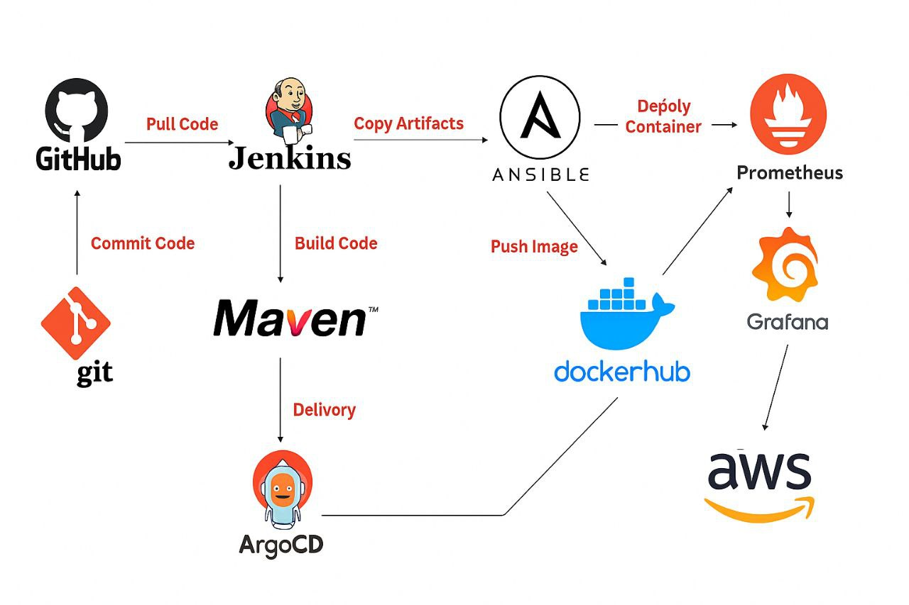

# Scalable Microservices E-commerce Application

This project implements a **fully automated, production-ready deployment pipeline** for a scalable microservices-based e-commerce application using:

- **Docker** for containerization
- **Ansible** for server provisioning
- **Terraform** for AWS infrastructure
- **Jenkins** for CI/CD
- **Kubernetes (Minikube)** for orchestration
- **Prometheus + Grafana** for monitoring
- **Argo CD** for GitOps-based continuous deployment


---

## System Overview

<p align="center">
  
</p>

---

## Architecture Overview

Terraform (AWS EC2) 
     |
Ansible (Provision Server, Install Docker)
     |
Jenkins (CI/CD Pipeline)
     |
Docker (Build App Images)
     |
Kubernetes (Deploy to Cluster)
     |
Prometheus + Grafana (Monitor)
     |
Argo CD (GitOps Deployment)
```

---

## Docker

Each microservice (auth, product, cart, payment, frontend, etc.) is:
- Packaged into a Docker container
- Pushed to Docker Hub with version tags
- Uses lightweight base images for efficiency

**Docker Compose** also used for local development/testing.

---

## Terraform – AWS EC2 Provisioning

- Creates an EC2 instance
- Outputs its public IP and DNS
- Adds correct inbound rules to allow:
  - HTTP (80)
  - HTTPS (443)
  - NodePort access for Prometheus/Grafana

### Outputs
```hcl
output "public_ip" {}
output "public_dns" {}
```

---

## Ansible – Server Provisioning

- Connects to the EC2 instance via SSH
- Installs:
  - `docker`, `docker-compose`
  - Pulls the latest Docker images
  - Runs the containers with correct ports
- Uses dynamic `hosts.ini` generated from Terraform

```bash
ansible-playbook -i hosts.ini deploy_app.yml \
  --private-key ~/Downloads/spring.pem \
  -e "ansible_ssh_common_args='-o StrictHostKeyChecking=no'"
```

---

## Jenkins – CI/CD

Pipeline includes:
- GitHub webhook triggers on push
- Builds Docker images
- Pushes to Docker Hub
- Triggers Ansible deployment to EC2
- Future extension: deploy to Kubernetes or Argo CD

---

## Prometheus + Grafana – Monitoring

- Prometheus scrapes metrics from Kubernetes pods
- Grafana displays dashboards with:
  - CPU, memory, disk, network I/O
  - Service availability
- Exposed via NodePort on Minikube:

```
Prometheus: http://192.168.49.2:30090
Grafana:    http://192.168.49.2:30030
```

---

## Argo CD – GitOps Deployment

- Watches Git repo for Kubernetes YAML changes
- Automatically syncs and applies updates to Minikube
- Login via NodePort:

```
ArgoCD: http://192.168.49.2:<port>
```

---

## Accessing the App

If deployed to AWS EC2:
```bash
http://<EC2_PUBLIC_IP>
```

If deployed locally with Minikube:
```bash
minikube service <service-name> -n <namespace>
```

---

## Local Development

```bash
# Start all services locally
docker-compose up --build
```

---

## Directory Structure

```
.
├── terraform/
│   └── main.tf, outputs.tf, variables.tf
├── ansible/
│   ├── deploy_app.yml
│   ├── hosts.ini
│   ├── update-hosts.sh
├── jenkins/
│   └── Jenkinsfile
├── k8s/
│   ├── manifests/
│   └── overlays/
├── monitoring/
│   ├── prometheus/
│   └── grafana/
├── app/
│   └── microservices/
```

---

## Security & Best Practices

- SSH key access only (no password)
- Docker Hub credentials stored as Ansible Vault secrets
- Kubernetes RBAC and namespaces used

---

## TODO

- Add Ingress Controller
- Set up alerting in Prometheus
- Deploy to AWS EKS or DigitalOcean

---
